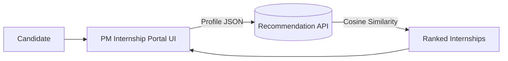

# AI-Based Internship Recommendation Engine (PM Internship Scheme) — SIH 2025 Prototype

Lightweight, mobile-friendly prototype using **Streamlit** + **cosine similarity** (ML-light) and a **Flask REST API** for future integration with the PM Internship portal.

## ✨ Features
- Captures **basic inputs**: skills, sector, location, education
- **ML-light**: one-hot vectors + cosine similarity
- **Top 3–5** recommendations with match score
- Simple **bilingual UI** (English/Hindi toggle)
- Ready **REST API** (`/recommend`) for easy portal integration

---

## 🧩 Project Structure
```
pm_internship_reco/
├─ data/
│  └─ internships.csv
├─ streamlit_app/
│  └─ app.py
├─ api/
│  └─ api.py
└─ requirements.txt
```

---

## 🚀 Run the Demo (Streamlit)

```bash
pip install -r requirements.txt
cd streamlit_app
streamlit run app.py
```
Open the local URL in your browser (works on mobile too).

---

## 🔗 REST API (Integration-Ready)

### Start API
```bash
pip install -r requirements.txt
cd api
python api.py
```
Runs on `http://127.0.0.1:5000`.

### POST `/recommend`
```json
{
  "skills": ["Python", "SQL"],
  "sector": "Technology",
  "location": "Delhi",
  "education_level": "UG",
  "top_k": 5
}
```

### Sample cURL
```bash
curl -X POST http://127.0.0.1:5000/recommend \
  -H "Content-Type: application/json" \
  -d '{"skills":["Python","SQL"],"sector":"Technology","location":"Delhi","education_level":"UG","top_k":5}'
```

---

## 🧱 Integration Options

### 1) IFrame Embed (for quick pilot)
```html
<iframe src="https://your-streamlit-app.hosted.url" width="100%" height="650" style="border:0;"></iframe>
```

### 2) API Integration (recommended for portal)
- PM portal collects candidate inputs (already present on portal).
- Portal sends JSON to `/recommend` and renders returned cards natively.

### 3) Microservice (Govt infra)
- Package API as Docker image and deploy on NIC/cloud. Portal calls internal endpoint.

---

## 🏗️ Architecture (Mermaid)


---

## 📌 Notes
- Dataset is a demo (24 internships). Replace `data/internships.csv` with live data export from the PM portal.
- The vectorizer builds vocab **from dataset** to keep it lightweight and deterministic.
- Add more languages by wrapping UI strings in the `t(en, hi)` helper.

---

## ✅ SIH Presentation Pointers
- Live demo: Streamlit prototype on laptop/phone
- 1 slide: Problem context
- 1 slide: How it works (vectors + cosine)
- 1 slide: Integration diagram (above)
- 1 slide: Future scope (feedback loop, more languages, accessibility icons)
```

